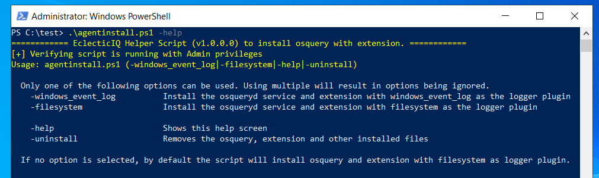
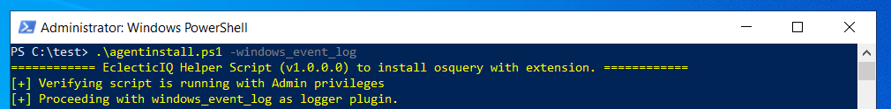
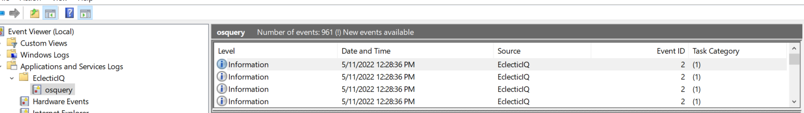
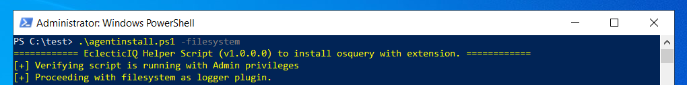
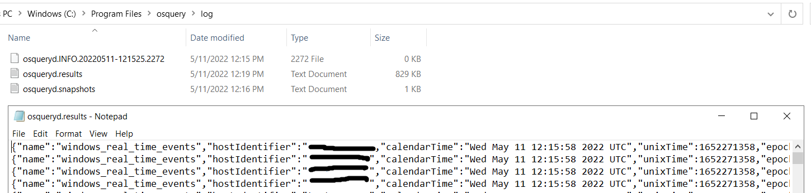
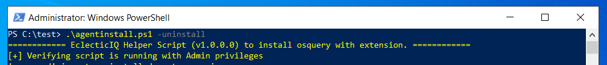

# EclecticIQ osquery extension

The management of an osquery tool typically requires a centralized agent management solution, such as [Eclectic Endpoint Response Community Edition](https://github.com/eclecticiq/eiq-er-ce),
[FleetDm](https://github.com/fleetdm/fleet), [SGT](https://github.com/OktaSecurityLabs/sgt) or [osctrl](https://osctrl.net/). A centralized management solution enables configuration and log management for a fleet of osquery agents and provides additional functionality. 
However, if you need to deploy a standalone osquery with an extension, such as EclecticIQ osquery extension on one or more endpoint devices with 
predefined configurations that are unlikely to change during the lifetime, then EclecticIQ provides a solution. 

You can install the EclecticIQ osquery Extension extension to add real-time event collection capabilities to osquery. 
You can deploy prebuilt config files (osquery agent) along with the EclecticIQ real-time event extension by using a simple PowerShell script. 
The deployment can be automated through other enterprise solutions, such as GPO or SCCM. During deployment, you can define if the query results are directed
to the Windows Event Log or a file on the filesystem. If the results are directed to a file, any existing can pick the data to forward to a centralized location (SIEM). 
Organizations in need of better visibility of activities on their endpoint devices can use such an approach, without getting into the complexities of deploying
an osquery management solution. The automated one-time deployment can also be a useful scenario for sandboxes where malwares are detonated and 
towards the end of which the activity done by the malware can be captured via the log files.

# Install

EclecticIQ provides a script to install osquery and EclecticIQ Windows osquery extension (plgx_win_extension.ext.exe) on any Windows x64 system. 
Follow these steps to install and use the EclecticIQ osquery extension:
-Ensure you do not have osquery installed. 
-If osquery is already installed, the script will skip the installation. 

Run the following PowerShell script to download the install script [agentinstall.ps1](https://github.com/eclecticiq/osq-ext-bin/raw/master/install/agentinstall.ps1):
~~~~~~~~~~~~~~~~~~~~~~~~~~~~~~~~~~~~~~~~~~~~~~~~~~~~~~~~~~~~~~~~~~~~~~~~~~~~~~~~
[System.Net.ServicePointManager]::SecurityProtocol = [System.Net.SecurityProtocolType]::TLS12
$webclient = New-Object System.Net.WebClient
$webclient.DownloadFile("https://github.com/eclecticiq/osq-ext-bin/raw/master/install/agentinstall.ps1","agentinstall.ps1")
~~~~~~~~~~~~~~~~~~~~~~~~~~~~~~~~~~~~~~~~~~~~~~~~~~~~~~~~~~~~~~~~~~~~~~~~~~~~~~~~

Optionally, to view help, run the agentinstall.ps1 script with -help option.   

To configure the script, two osquery logger plugin options are available.

## windows_event_log

When you use this option, osquery and extension are installed with windows_event_log logger plugin.

This will generate osquery logs in the Windows event viewer (Applications and Services Logs -> EclecticIQ -> osquery).

## filesystem 

If you provide no option or use the -filesystem option, the script installs osquery and extension with filesystem logger plugin

This will generate osquery logs in c:\program files\osquery\log folder.

For more information on the osquery logger plugins feature, review this [information](https://osquery.readthedocs.io/en/stable/deployment/logging/)

# Uninstall 

To uninstall the osquery and extension, use -uninstall option.

# FAQ

1.  What is extension version installed with the script?

The script installs EclecticIQ extension version 3.5.1.0 which is digitally signed by EclecticIQ.

2.  What osquery version does it install?

The script installs osquery version 5.2.2.

3. I want to customize osquery config in osquery.conf file to be used with the install script. What do I do?

- Fork the repository and clone it
- Update osquery.conf file as per your requirements and push the changes to your fork
- Update the url of osquery.conf (pointing to your fork) in agentinstall.ps1 (line 13) against $osqueryConfDownloadUrl variable. Default value is: 'https://github.com/eclecticiq/osq-ext-bin/raw/master/install/osquery.conf' 
- Next time you run agentinstall.ps1, it will pull the osquery.conf from your fork with custom osquery config

# Contact us

For issues and questions, you can contact support\@eclecticiq.com or reach us on [osquery
slack](https://osquery.slack.com/) at channel \# eclecticiq-polylogyx-extension
